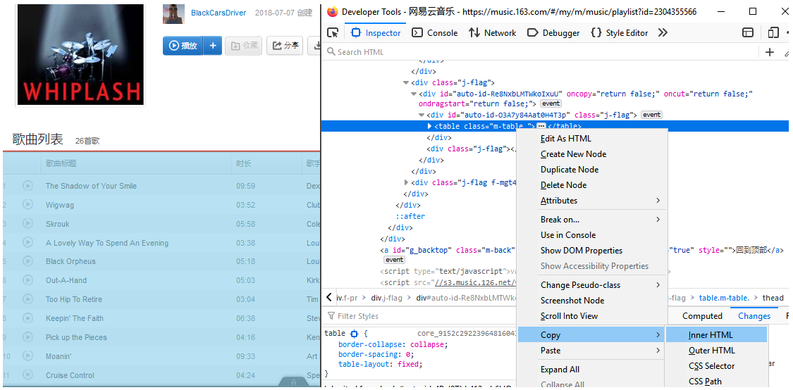
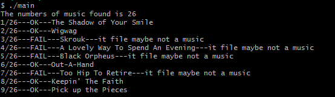

# 网易云音乐自动下载器

2020/07/26

### 介绍

网易云的吃相越来越难看了，个人歌单里面的音乐列表突然间都变成需要VIP才能播放。于是一气之下做了个音乐批量下载工具，将那些能播放的音乐统统保存到本地。

### 使用方法

1. 浏览器进入[网易云音乐](https://music.163.com/)，登录帐号，选择一个歌单

2. 进入开发者工具，选择并复制表示歌曲列表的`<table class="m_table">`标签，复制其中的全部内容

   

3. 将文本拷贝到main目标下的`garget.html`

4. 双击图标或在命令行运行main.exe,网页上的音乐列表自动被下载到同目录下的`tmp`中

   

5. 注意应一些音乐可能因为vip权限无法播放，程序将其保存为xxx.mp3.err，请自行判断并处理

